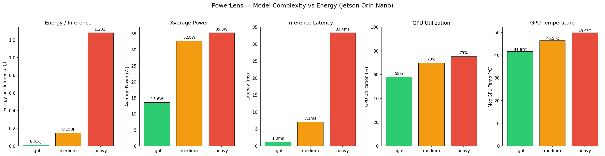
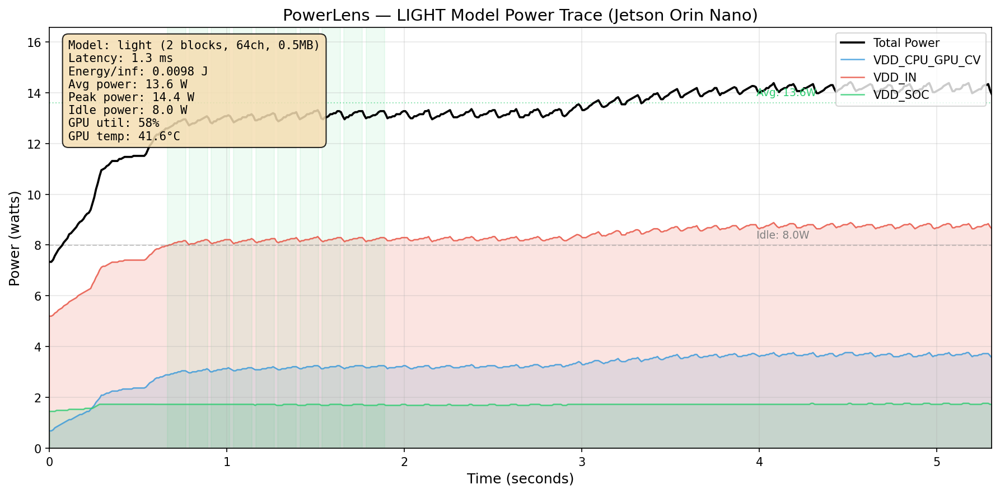
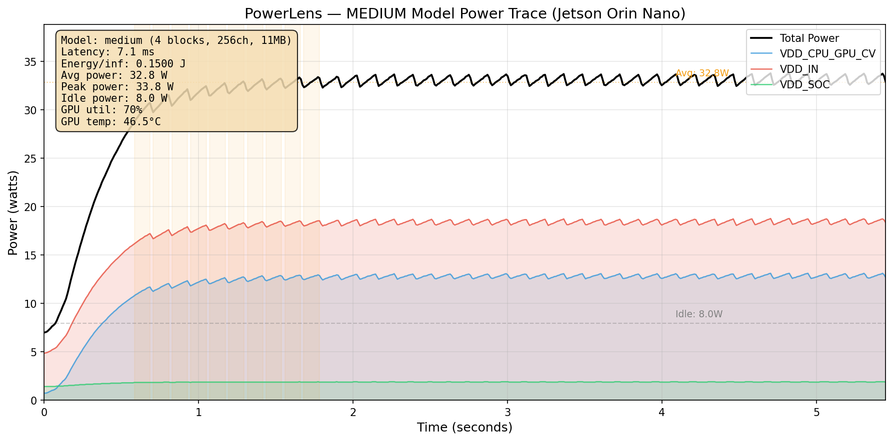
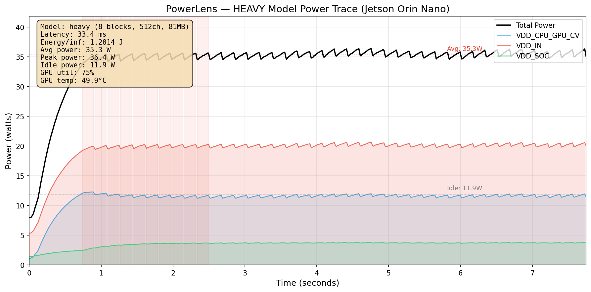
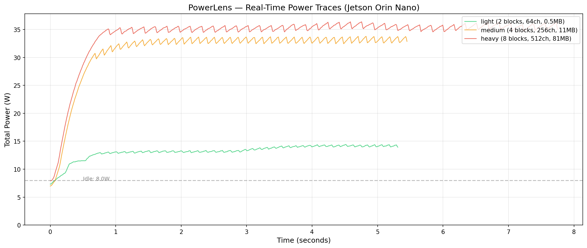
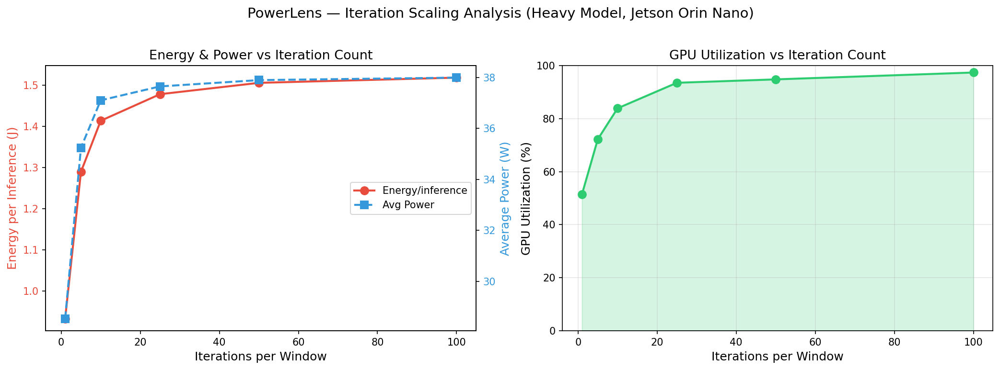
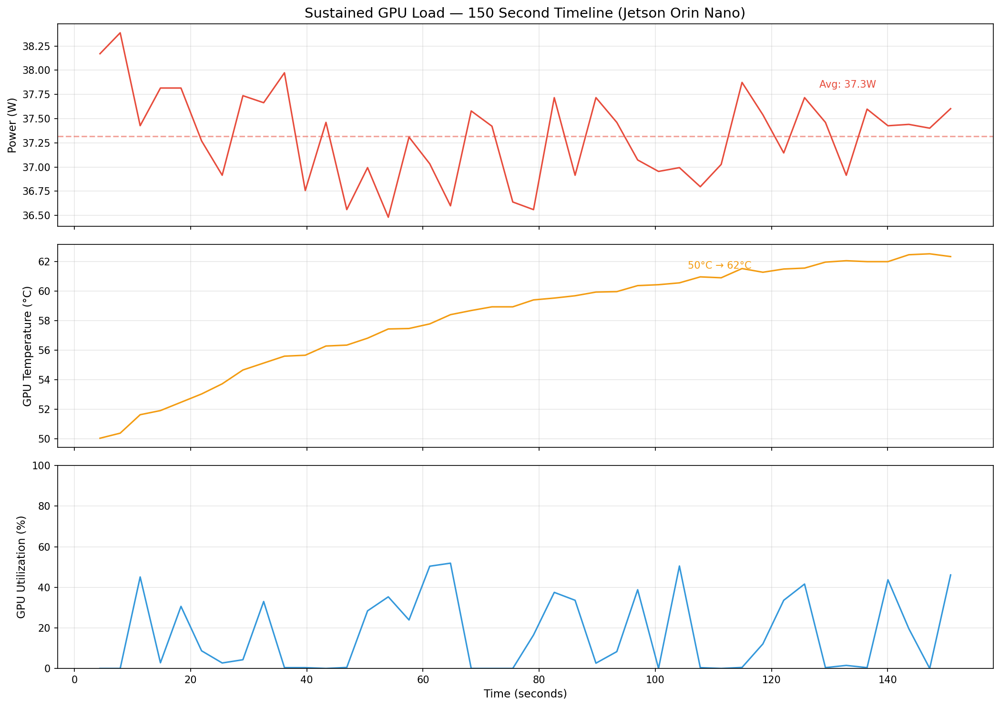
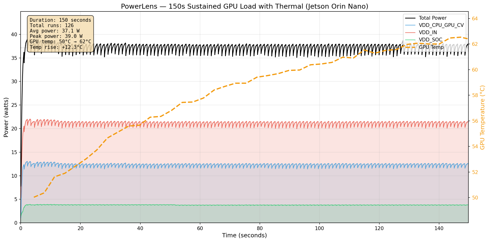

# ⚡ PowerLens

[](https://github.com/ssaserkar/powerlens/actions/workflows/test.yml)
[](https://pypi.org/project/powerlens/)
[](https://www.python.org/downloads/)
[](https://opensource.org/licenses/Apache-2.0)

**How much energy does your AI model actually use? PowerLens tells you.**

PowerLens measures the real power consumption of AI models running on NVIDIA Jetson devices. It reads the built-in hardware power sensors and tells you exactly how many joules each inference costs — no extra equipment needed.

**Tested on real hardware. Matches NVIDIA's own measurements within 2%.**

---

## The Problem

You know how fast your model runs. You know how accurate it is. But do you know how much electricity it uses per inference?

If you're running AI on battery-powered devices (robots, drones, cameras), energy per inference decides how long your device stays alive. If you're deploying thousands of Jetson devices, it decides your electricity bill.

Existing tools like `tegrastats` show you total power once per second. They can't tell you how much energy a single inference costs, or which of your two models is more efficient.

**PowerLens can.**

---

## What It Does

```bash
# Measure energy consumption of any ONNX model
powerlens profile --onnx model.onnx --runs 50

# Compare two models — which one is more efficient?
powerlens compare model_a.onnx model_b.onnx

# Test all power modes — which setting saves the most energy?
sudo powerlens power-modes --onnx model.onnx

# Check what sensors are available
powerlens detect
```

---

## Real Measurements from Jetson Orin Nano

Everything below is real data from a Jetson Orin Nano running MAXN_SUPER mode. Not simulated. Each test started after thermal cooldown to 40°C for consistent results.

### Three Models, Three Power Profiles

We tested three models of increasing size to show how model complexity affects energy:

| Model  | Size   | Inference Time | Energy per Inference | Average Power | GPU Usage | Max GPU Temp |
|--------|--------|----------------|----------------------|---------------|-----------|--------------|
| Small  | 0.5 MB | 1.3 ms         | 0.010 J              | 13.6 W        | 58%       | 41.6°C       |
| Medium | 11 MB  | 7.1 ms         | 0.150 J              | 32.8 W        | 70%       | 46.5°C       |
| Large  | 81 MB  | 33.4 ms        | 1.281 J              | 35.3 W        | 75%       | 49.9°C       |

**The large model uses 128x more energy per inference than the small model.**



### Where Does the Power Go?

PowerLens breaks down power by rail — GPU, CPU, and system — so you can see exactly where the energy is spent. Each model has its own distinct power signature:

**Small Model** — barely wakes the GPU:



**Medium Model** — GPU fully engaged:



**Large Model** — GPU saturated, drawing maximum power:



### All Three Models Overlaid

Same time scale, showing the dramatic difference in power draw:



### How GPU Load Affects Energy

Running more iterations back-to-back pushes GPU utilization from 51% to 97% and increases power from 28.5W to 38.0W:

| Iterations | Energy/Inference | Average Power | GPU Utilization |
|------------|------------------|---------------|-----------------|
| 1          | 0.933 J          | 28.5 W        | 51%             |
| 5          | 1.289 J          | 35.2 W        | 72%             |
| 10         | 1.413 J          | 37.1 W        | 84%             |
| 25         | 1.478 J          | 37.6 W        | 94%             |
| 50         | 1.505 J          | 37.9 W        | 95%             |
| 100        | 1.518 J          | 38.0 W        | 97%             |



### Which Power Mode Is Most Efficient?

Jetson has multiple power modes. PowerLens tests them all automatically:

```
Power Mode Comparison — ResNet18
======================================================================
Mode               Latency   Energy/inf    Avg Power   Efficiency
----------------------------------------------------------------------
15W                   2.9ms      0.015J       11.6W       68.0 inf/J
25W                   2.9ms      0.015J       11.8W       69.1 inf/J
MAXN_SUPER            2.9ms      0.015J       12.1W       65.4 inf/J
----------------------------------------------------------------------
Most efficient: 25W mode

→ 25W mode is more energy efficient than max performance mode
```

### 150-Second Stress Test

Running the large model continuously for 150 seconds. GPU temperature rises 10°C while power stays stable:





```
Idle power:      10.4 W
Load power:      37.4 W average (255% increase)
GPU temperature: 52.5°C → 62.5°C (+10°C over 150 seconds)
GPU frequency:   1020 MHz sustained
Throttling:      None detected ✓
```

---

## Install

```bash
pip install powerlens
```

On Jetson:

```bash
pip install powerlens[jetson]
powerlens detect    # check sensors are working
```

---

## Usage

### From the Command Line

| Command | What it does |
|---------|-------------|
| `powerlens demo` | Quick demo with simulated sensor |
| `powerlens demo --real` | Demo with real hardware sensor |
| `powerlens detect` | Show available sensors |
| `powerlens profile --onnx model.onnx` | Measure energy of a model |
| `powerlens compare a.onnx b.onnx` | Compare two models |
| `powerlens power-modes --onnx model.onnx` | Test all power modes (needs sudo) |
| `powerlens batch-scaling --onnx model.onnx` | Test energy at different loads |

### From Python

```python
import powerlens

# Profile your own inference code
with powerlens.context() as ctx:
    for image in test_images:
        ctx.mark_inference_start()
        result = model.infer(image)
        ctx.mark_inference_end()

report = ctx.report()
print(report.summary())
```

### Example Output

```
PowerLens Inference Energy Report
==========================================
Inferences:         20
Sample rate:        99.8 Hz

Energy/inference:   0.6778 +/- 0.0768 J
  Min:              0.4738 J
  Max:              0.7714 J

Power (avg):        12.57 W
Power (peak):       12.88 W
Power (idle):       7.71 W

Rail breakdown (avg power):
  VDD_IN               7.73 W (64%)
  VDD_CPU_GPU_CV       2.48 W (21%)
  VDD_SOC              1.79 W (15%)

Thermal Analysis
==========================================
  gpu-thermal          avg=38.6°C  max=39.2°C
  cpu-thermal          avg=37.3°C  max=37.5°C
✓ No thermal throttling detected

GPU Utilization
==========================================
  GPU util:  avg=41%  max=94%  min=0%
```

---

## What It Measures

- **Energy per inference** — how many joules each inference costs
- **Power per rail** — GPU, CPU, and system power separately
- **GPU utilization** — how busy the GPU is during inference
- **GPU clock speed** — current frequency in MHz
- **Temperature** — 9 thermal zones including GPU and CPU
- **Thermal throttling** — detects when heat causes performance drops

---

## How Is This Different?

| Tool | What it does | What's missing |
|------|-------------|----------------|
| **tegrastats** | Shows total power once per second | Can't measure per-inference energy |
| **jtop** | Pretty dashboard with power and GPU stats | No per-inference correlation |
| **PowerSensor3** | Very accurate power with custom hardware | Requires buying/building extra hardware |
| **Nsight Systems** | GPU compute profiling | No power measurement |
| **PowerLens** | Per-inference energy with power + thermal + GPU in one report | Requires Jetson for real measurements |

---

## Run the Full Showcase

Generate demo models and run the complete analysis yourself:

```bash
cd examples/
python create_demo_model.py         # Creates small/medium/large models
python generate_readme_plots.py     # Generates all plots (~10 minutes)
python full_showcase.py             # Runs full 3-part analysis (~5 minutes)
```

---

## How It Works

1. Reads power sensors built into the Jetson board (INA3221 via sysfs)
2. Samples power 100 times per second in a background thread
3. Records when each inference starts and ends
4. Calculates energy by integrating power over time for each inference
5. Monitors GPU utilization and temperature simultaneously
6. Produces reports, CSVs, and plots

---

## Project Structure

```
powerlens/
├── src/powerlens/
│   ├── sensors/        # Power sensors, GPU monitor
│   ├── profiler/       # Sampling, session API, TensorRT runner
│   ├── analysis/       # Energy, thermal, power modes, batch scaling
│   ├── export/         # CSV export
│   ├── visualization/  # Power trace plots
│   └── cli.py          # All CLI commands
├── tests/              # 39 tests
└── examples/
    ├── quickstart.py               # Profile your own code
    ├── demo_tensorrt.py            # TensorRT profiling
    ├── create_demo_model.py        # Generate test models
    ├── generate_readme_plots.py    # Generate all plots
    └── full_showcase.py            # Complete analysis
```

---

## Requirements

- Python 3.9+
- NVIDIA Jetson for real measurements (Orin Nano, AGX Orin)
- TensorRT for model profiling (included with JetPack)
- Works anywhere with mock sensor for development

---

## Related Work

- [Chakraborty et al. (2024)](https://arxiv.org/html/2508.08430v1) — Profiling concurrent vision inference on Jetson (compute-level)
- [Li & Zheng (2022)](https://par.nsf.gov/servlets/purl/10208378) — Profiling Jetson GPU devices for autonomous machines
- [Van der Vlugt et al. (2024)](https://arxiv.org/pdf/2504.17883) — PowerSensor3: high-accuracy external power measurement
- [powertool](https://github.com/nmenon/powertool) — INA226 power measurement for TI boards

PowerLens fills the gap: per-inference energy measurement using built-in sensors with zero extra hardware.

---

## Contributing

Contributions welcome! See [CONTRIBUTING.md](CONTRIBUTING.md).

**Help needed with:**

- Support for other Jetson boards (Xavier NX, AGX Orin, TX2)
- PyTorch inference hooks
- Real-time terminal dashboard
- PDF report generation

---

## License

[Apache 2.0](LICENSE) — use it in your research, your startup, your thesis.

---

## Citation

If PowerLens helps your research:

```bibtex
@software{powerlens2025,
  title={PowerLens: Per-Inference Energy Profiling for NVIDIA Jetson},
  author={Aserkar, S.},
  year={2025},
  url={https://github.com/ssaserkar/powerlens}
}
```