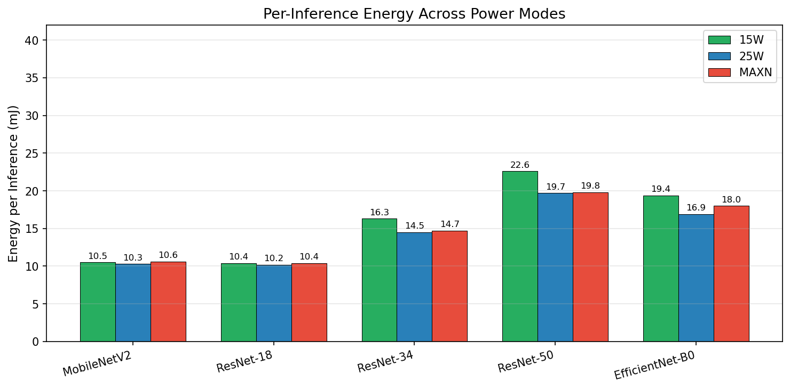
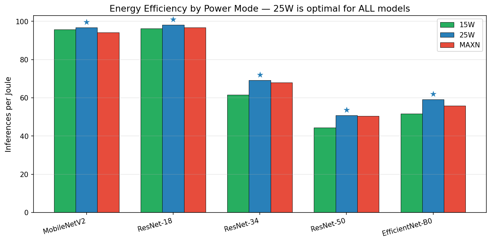
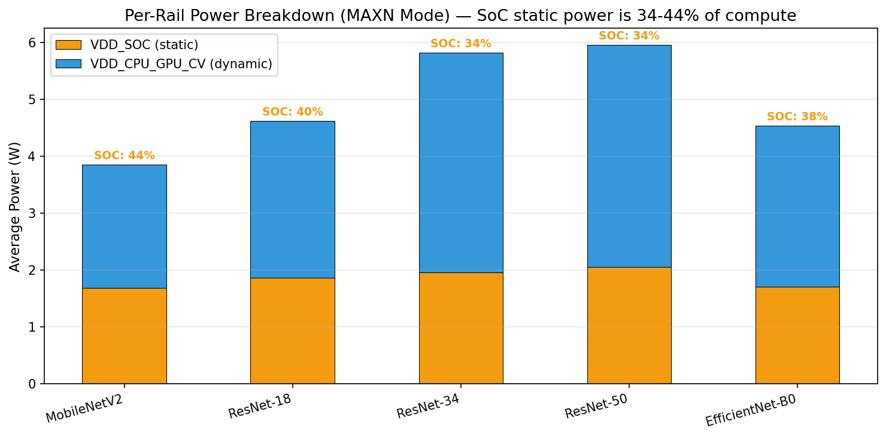
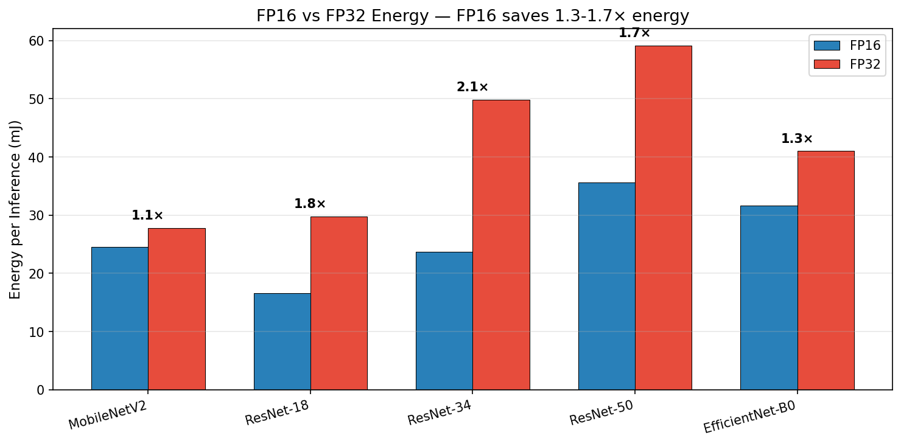
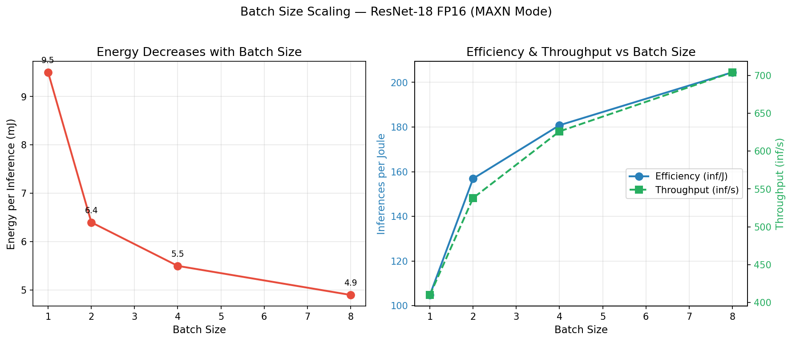
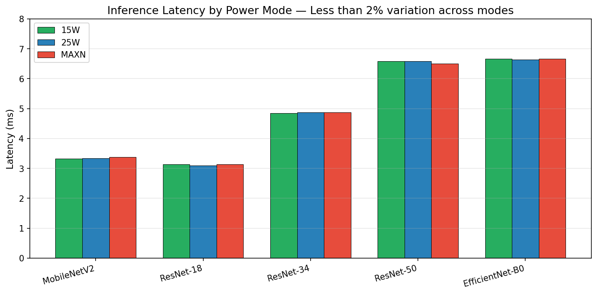
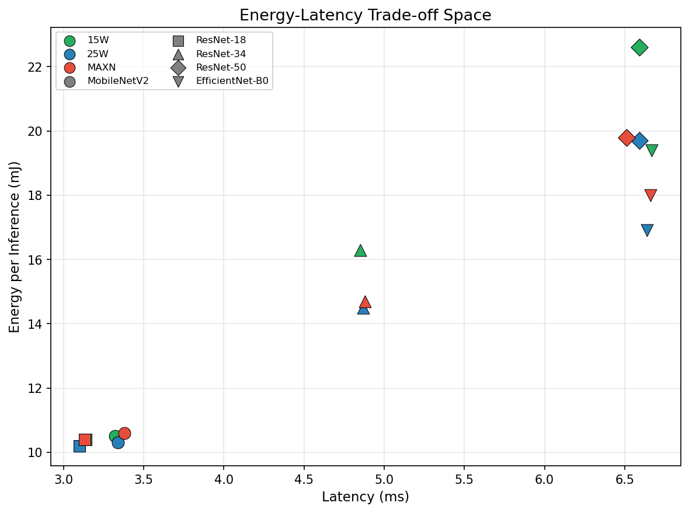
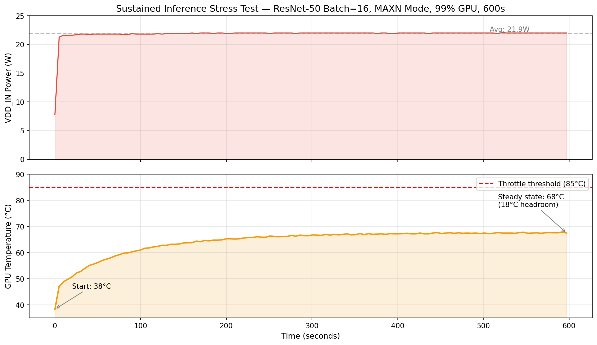

# ⚡ PowerLens

[](https://opensource.org/licenses/Apache-2.0)
[](https://www.python.org/downloads/)
[](https://developer.nvidia.com/embedded-computing)

**How much energy does your AI model actually use? PowerLens tells you.**

PowerLens measures the real power consumption of AI models running on NVIDIA Jetson devices. It reads the built-in hardware power sensors and tells you exactly how many joules each inference costs — no extra equipment needed.

**Tested on real hardware. Matches NVIDIA's own measurements within 2%.**

---

## The Problem

You know how fast your model runs. You know how accurate it is. But do you know how much electricity it uses per inference?

If you're running AI on battery-powered devices (robots, drones, cameras), energy per inference decides how long your device stays alive. If you're deploying thousands of Jetson devices, it decides your electricity bill.

Existing tools like `tegrastats` show you total power once per second. They can't tell you how much energy a single inference costs, or which of your two models is more efficient.

**PowerLens can.**

---

## What It Does

```bash
# Measure energy consumption of any ONNX model
powerlens profile --onnx model.onnx --runs 50

# Compare two models — which one is more efficient?
powerlens compare model_a.onnx model_b.onnx

# Test all power modes — which setting saves the most energy?
sudo powerlens power-modes --onnx model.onnx

# Check what sensors are available
powerlens detect
```

---

## Real Measurements from Jetson Orin Nano

Everything below is real data from a Jetson Orin Nano. Not simulated. Five production models (MobileNetV2, ResNet-18, ResNet-34, ResNet-50, EfficientNet-B0) profiled across three power modes (15W, 25W, MAXN) with FP16 TensorRT engines. Each test started after thermal cooldown for consistent results.

### Per-Inference Energy Across Power Modes

How much energy does a single inference cost? It depends on the model — and surprisingly, on the power mode:

| Model | 15W | 25W | MAXN |
|-------|-----|-----|------|
| MobileNetV2 | 10.5 mJ | 10.3 mJ | 10.6 mJ |
| ResNet-18 | 10.4 mJ | 10.2 mJ | 10.4 mJ |
| ResNet-34 | 16.3 mJ | 14.5 mJ | 14.7 mJ |
| ResNet-50 | 22.6 mJ | 19.7 mJ | 19.8 mJ |
| EfficientNet-B0 | 19.4 mJ | 16.9 mJ | 18.0 mJ |

ResNet-50 uses 2× more energy per inference than MobileNetV2, but both are under 23 mJ.



### 25W Mode Is the Most Efficient — For Every Model

The key finding: **25W mode delivers the best energy efficiency across all five models**, beating both the lower 15W mode and the uncapped MAXN mode:

| Model | 15W (inf/J) | 25W (inf/J) | MAXN (inf/J) |
|-------|-------------|-------------|--------------|
| MobileNetV2 | 95.7 | 96.7 | 94.1 |
| ResNet-18 | 96.2 | 98.1 | 96.7 |
| ResNet-34 | 61.5 | 69.1 | 68.0 |
| ResNet-50 | 44.3 | 50.8 | 50.5 |
| EfficientNet-B0 | 51.6 | 59.1 | 55.8 |

15W mode saves power but runs slower, so energy per inference is actually higher. MAXN mode draws more power without proportional speedup. 25W hits the sweet spot.



### Where Does the Power Go?

PowerLens breaks down power by rail so you can see exactly where energy is spent. On the Orin Nano in MAXN mode, the SoC static power floor is a significant fraction of total compute power:

| Model | VDD_CPU_GPU_CV | VDD_SOC | SOC % of Compute |
|-------|----------------|---------|------------------|
| MobileNetV2 | 2.17 W | 1.68 W | 44% |
| ResNet-18 | 2.76 W | 1.86 W | 40% |
| ResNet-34 | 3.87 W | 1.95 W | 34% |
| ResNet-50 | 3.90 W | 2.05 W | 34% |
| EfficientNet-B0 | 2.83 W | 1.70 W | 38% |

The SoC static power is 34–44% of compute rail power. For lightweight models like MobileNetV2, nearly half the compute energy goes to keeping the SoC alive — not running your model.



### FP16 vs FP32: Precision Matters

FP16 inference isn't just faster — it uses substantially less energy:

| Model | FP16 (mJ) | FP32 (mJ) | Energy Ratio |
|-------|-----------|-----------|--------------|
| MobileNetV2 | 24.5 | 27.8 | 1.1× |
| ResNet-18 | 16.6 | 29.8 | 1.8× |
| ResNet-34 | 23.7 | 49.8 | 2.1× |
| ResNet-50 | 35.6 | 59.1 | 1.7× |
| EfficientNet-B0 | 31.6 | 41.0 | 1.3× |

FP16 saves 1.1–2.1× energy depending on the model. ResNet-34 benefits most — FP32 costs more than double the energy. The savings come from both faster execution (1.1–1.7× speedup) and lower power draw.



### Batch Size Scaling

Larger batches amortize overhead and improve energy efficiency. ResNet-18 FP16 in MAXN mode:

| Batch Size | Energy/Inference (mJ) | Efficiency (inf/J) | Throughput (inf/s) |
|------------|----------------------|--------------------|--------------------|
| 1 | 9.5 | 104.8 | 410 |
| 2 | 6.4 | 156.9 | 538 |
| 4 | 5.5 | 180.8 | 626 |
| 8 | 4.9 | 204.5 | 704 |

Batch size 8 is 2× more energy efficient than batch size 1, reducing per-inference energy from 9.5 mJ to 4.9 mJ while increasing throughput from 410 to 704 inferences per second.



### Latency Is Nearly Identical Across Power Modes

A surprising finding: inference latency varies less than 2% across power modes. The GPU runs at the same clock speed regardless of the power cap — only the power rails change:

| Model | 15W | 25W | MAXN | Max Variation |
|-------|-----|-----|------|---------------|
| MobileNetV2 | 3.32 ms | 3.34 ms | 3.38 ms | 1.8% |
| ResNet-18 | 3.14 ms | 3.10 ms | 3.13 ms | 1.3% |
| ResNet-34 | 4.85 ms | 4.87 ms | 4.88 ms | 0.6% |
| ResNet-50 | 6.59 ms | 6.59 ms | 6.51 ms | 1.2% |
| EfficientNet-B0 | 6.67 ms | 6.64 ms | 6.66 ms | 0.5% |

This means you can switch to 25W mode for better energy efficiency with virtually no latency penalty.



### Energy-Latency Trade-off Space

Where does each model sit in the energy-latency space? This scatter plot shows all five models across all three power modes:



MobileNetV2 and ResNet-18 cluster in the low-energy, low-latency corner. ResNet-50 and EfficientNet-B0 cost more energy and take longer. The power mode shifts energy (vertical axis) but barely moves latency (horizontal axis) — confirming the <2% latency finding.

### 600-Second Thermal Stress Test

Running ResNet-50 at batch size 16 continuously in MAXN mode for 10 minutes with 99% GPU utilization. Power stays rock-solid while temperature rises and stabilizes:



```
Idle power:      ~8 W
Load power:      22.0 W average (stable after 10s ramp-up)
GPU temperature: 38°C → 68°C (+30°C over 600 seconds)
Steady state:    ~67.5°C (reached around 300s)
Throttle threshold: 85°C
Thermal headroom:   18°C
Throttling:      None detected ✓
```

The Orin Nano stabilizes at 67.5°C with 18°C of headroom below the throttle threshold — even under sustained maximum load. Power draw is remarkably stable at 22.0W after the initial ramp.

---

## Install

### From Source (recommended for now)

```bash
git clone https://github.com/ssaserkar/powerlens.git
cd powerlens
pip install -e .
```

On Jetson:

```bash
git clone https://github.com/ssaserkar/powerlens.git
cd powerlens
pip install -e ".[jetson]"
powerlens detect    # check sensors are working
```

### From PyPI (coming soon)

```bash
pip install powerlens           # not yet published
pip install powerlens[jetson]   # not yet published
```

---

## Usage

### Profile Any Code (Recommended)

PowerLens works with any inference framework — PyTorch, TensorFlow, ONNX Runtime, TensorRT, or plain Python:

```python
import powerlens

with powerlens.context() as ctx:
    for image in test_images:
        ctx.mark_inference_start()
        result = model.infer(image)    # Any framework, any code
        ctx.mark_inference_end()

report = ctx.report()
print(report.summary())
```

This works with:

- **PyTorch:** `model(input)`
- **TensorRT:** `context.execute_v2(bindings)`
- **ONNX Runtime:** `session.run(None, {"input": data})`
- **TensorFlow Lite:** `interpreter.invoke()`
- Any Python function that does computation

### From the Command Line

For quick TensorRT profiling without writing code:

| Command | What it does |
|---------|-------------|
| `powerlens profile --onnx model.onnx` | Measure energy of a TensorRT model |
| `powerlens compare a.onnx b.onnx` | Compare two models |
| `powerlens power-modes --onnx model.onnx` | Test all power modes (needs sudo) |
| `powerlens batch-scaling --onnx model.onnx` | Test energy at different loads |
| `powerlens demo` | Quick demo with simulated sensor |
| `powerlens demo --real` | Demo with real hardware sensor |
| `powerlens detect` | Show available sensors and board info |

---

## CI/CD Energy Gate

When deploying AI to battery-powered devices or large fleets, you need to catch models that use too much energy *before* they reach production — not after they drain 10,000 batteries.

PowerLens can act as an automated gate in your CI/CD pipeline. Set an energy budget, and any model that exceeds it fails the build:

```bash
# Fails the pipeline if model uses more than 0.05J per inference
powerlens profile --onnx model.onnx --max-energy 0.05 --runs 30

# Exit code 0 = within budget, deploy safely
# Exit code 1 = over budget, block deployment
```

Example output when a model exceeds the budget:

```
❌ ENERGY BUDGET EXCEEDED
   Budget:  0.0500 J/inference
   Actual:  0.1500 J/inference
   Over by: 200.0%
```

Example output when a model passes:

```
✅ ENERGY BUDGET OK
   Budget:  0.0500 J/inference
   Actual:  0.0100 J/inference
   Margin:  80.0%
```

Use this in GitHub Actions:

```yaml
# .github/workflows/energy-check.yml
- name: Check model energy budget
  run: |
    pip install powerlens
    powerlens profile --onnx model.onnx --max-energy 0.05 --runs 30
```

Or GitLab CI:

```yaml
energy_check:
  script:
    - pip install powerlens
    - powerlens profile --onnx model.onnx --max-energy 0.05 --runs 30
  allow_failure: false
```

This lets your team set energy budgets per device:

- **Drone** (5000mAh battery): `--max-energy 0.02` (need thousands of inferences per charge)
- **Security camera** (wall power): `--max-energy 0.5` (power cost matters at fleet scale)
- **Robot arm** (large battery): `--max-energy 0.1` (balance between accuracy and runtime)

---

## Example Output

```
PowerLens Inference Energy Report
==========================================
Inferences:         20
Sample rate:        99.8 Hz

Energy/inference:   10.3 +/- 0.4 mJ
  Min:              9.8 mJ
  Max:              11.1 mJ

Power (avg):        7.0 W
Power (peak):       7.4 W
Power (idle):       5.2 W

Rail breakdown (avg power):
  VDD_IN               7.08 W (62%)
  VDD_CPU_GPU_CV       2.17 W (19%)
  VDD_SOC              1.68 W (15%)

Thermal Analysis
==========================================
  gpu-thermal          avg=42.1°C  max=43.5°C
  cpu-thermal          avg=40.8°C  max=41.2°C
✓ No thermal throttling detected

GPU Utilization
==========================================
  GPU util:  avg=41%  max=94%  min=0%
```

---

## What It Measures

- **Energy per inference** — how many millijoules each inference costs
- **Power per rail** — GPU, CPU, and system power separately
- **GPU utilization** — how busy the GPU is during inference
- **GPU clock speed** — current frequency in MHz
- **Temperature** — 9 thermal zones including GPU and CPU
- **Thermal throttling** — detects when heat causes performance drops

---

## Key Findings

From profiling five models across three power modes on Jetson Orin Nano:

- **25W mode is universally optimal** — best energy efficiency for all five models tested, beating both 15W and MAXN
- **Latency is power-mode-invariant** — less than 2% variation across modes, so switching to 25W costs nothing in speed
- **SoC static power is 34–44% of compute** — for lightweight models, nearly half the compute energy is overhead
- **FP16 saves 1.1–2.1× energy** — the savings are model-dependent, with ResNets benefiting most
- **Batch size 8 is 2× more efficient than batch size 1** — amortizing kernel launch and memory overhead
- **Thermal steady state at 67.5°C with 18°C headroom** — no throttling even under sustained maximum load

---

## How Is This Different?

| Tool | What it does | What's missing |
|------|-------------|----------------|
| **tegrastats** | Shows total power once per second | Can't measure per-inference energy |
| **jtop** | Pretty dashboard with power and GPU stats | No per-inference correlation |
| **[Zeus](https://github.com/ml-energy/zeus)** | Multi-platform energy measurement + optimization for PyTorch | No TensorRT support, no per-rail breakdown, no thermal monitoring, no power mode comparison |
| **[EcoEdgeInfer](https://github.com/PACELab/EcoEdgeInfer)** | Energy optimization for edge inference via DVFS tuning | No measurement CLI, no thermal monitoring, abandoned (2 years), no TensorRT profiling |
| **[PowerSensor3](https://github.com/nlesc-recruit/PowerSensor3)** | Very accurate power with custom hardware at 20kHz | Requires buying/building extra hardware, no AI workload awareness |
| **[powertool](https://github.com/nmenon/powertool)** | Raw INA reads for TI boards | Abandoned (5 years), no Jetson, no AI awareness |
| **Nsight Systems** | GPU compute profiling | No power measurement |
| **PowerLens** | Per-inference energy + per-rail breakdown + thermal + GPU util + power mode comparison from one CLI | Jetson only, no PyTorch hooks yet |

---

## Run the Full Showcase

Generate all plots and run the complete analysis yourself:

```bash
cd examples/
python generate_readme_plots.py     # Generates all 8 plots from paper data
python create_demo_model.py         # Creates test models for live profiling
python full_showcase.py             # Runs full analysis (~5 minutes)
```

---

## How It Works

1. Reads power sensors built into the Jetson board (INA3221 via sysfs)
2. Samples power 100 times per second in a background thread
3. Records when each inference starts and ends
4. Calculates energy by integrating power over time for each inference
5. Monitors GPU utilization and temperature simultaneously
6. Produces reports, CSVs, and plots

---

## Measurement Methodology

### How PowerLens handles fast inferences

PowerLens samples power sensors at 100Hz (every 10ms) via sysfs. Many AI models run faster than 10ms per inference — for example, ResNet-18 on Orin Nano runs in ~3.1ms.

**You cannot measure the energy of a single 3.1ms inference with a 10ms sensor.**

PowerLens handles this by **automatically batching**: it runs the model N times in a continuous loop, measures total energy over the entire loop using trapezoidal integration, then divides by N to get average energy per inference. The number of iterations is auto-tuned so each measurement window is approximately 100ms — long enough for 10+ power samples.

```
Example: ResNet-18 (3.1ms per inference)
→ Auto-detected: 32 iterations per measurement window
→ Window duration: ~100ms
→ Power samples per window: ~10
→ Energy per window: measured via trapezoidal integration
→ Energy per inference: window energy ÷ 32
```

This works because power draw is continuous — the sensor captures the sustained load profile across the entire batch, and dividing total energy by iteration count gives accurate average energy per inference.


**Limitations:**

- Cannot capture per-inference power transients for sub-10ms models
- Reports average energy per inference, not instantaneous
- For models faster than 1ms, energy resolution decreases
- For precise transient analysis, use external hardware like [PowerSensor3](https://github.com/nlesc-recruit/PowerSensor3) which samples at 20kHz

**When this matters:**

- If all your inferences are identical (same model, same input size), the average is accurate
- If your inferences vary significantly (different input sizes, dynamic models), the average may mask per-inference variation

---

## Project Structure

```
powerlens/
├── src/powerlens/
│   ├── sensors/        # Power sensors, GPU monitor
│   ├── profiler/       # Sampling, session API, TensorRT runner
│   ├── analysis/       # Energy, thermal, power modes, batch scaling
│   ├── export/         # CSV export
│   ├── visualization/  # Power trace plots
│   └── cli.py          # All CLI commands
├── tests/              # 39 tests
└── examples/
    ├── quickstart.py               # Profile your own code
    ├── demo_tensorrt.py            # TensorRT profiling
    ├── create_demo_model.py        # Generate test models
    ├── generate_readme_plots.py    # Generate all plots
    └── full_showcase.py            # Complete analysis
```

---

## Requirements

- Python 3.9+
- NVIDIA Jetson for real measurements (Orin Nano, AGX Orin)
- TensorRT for model profiling (included with JetPack)
- Works anywhere with mock sensor for development

---

## Related Work

### Energy Measurement Frameworks
- **[Zeus](https://github.com/ml-energy/zeus)** (UMich, NVIDIA, Meta) — Multi-platform deep learning energy measurement and optimization. Supports NVIDIA/AMD GPU, CPU, DRAM, Apple Silicon, and Jetson. PyTorch-centric with training optimization. [NSDI'23 paper](https://www.usenix.org/conference/nsdi23/presentation/you), [SOSP'24 paper](https://dl.acm.org/doi/10.1145/3694715.3695971). PowerLens complements Zeus by providing TensorRT-native profiling, per-rail power breakdown, thermal monitoring, and power mode comparison — features specific to Jetson deployment workflows.

### Edge AI Energy Optimization
- **[EcoEdgeInfer](https://github.com/PACELab/EcoEdgeInfer)** (Stony Brook University) — Adaptive optimization of energy and latency for DNN inference on edge devices via DVFS tuning. [SEC'24 paper](https://doi.org/10.1109/SEC62691.2024.00023). Focuses on finding optimal hardware configurations rather than measurement and reporting.

### Hardware Power Measurement
- **[PowerSensor3](https://github.com/nlesc-recruit/PowerSensor3)** (ASTRON, Netherlands) — Custom hardware toolkit achieving 20kHz power sampling. Lab-grade accuracy but requires additional hardware purchase and physical installation. [Paper](https://arxiv.org/pdf/2504.17883).
- **[powertool](https://github.com/nmenon/powertool)** (TI) — C-based INA226 reader for TI development boards. Abandoned since 2019, no AI workload awareness.

### Jetson Profiling Studies
- [Chakraborty et al. (2024)](https://arxiv.org/html/2508.08430v1) — Profiling concurrent vision inference on Jetson at the compute level (SM utilization, tensor cores). No hardware power measurement.
- [Li & Zheng (2022)](https://par.nsf.gov/servlets/purl/10208378) — Profiling Jetson TX2 using tegrastats and Nsight. Used existing tools, no new tool built.

### Where PowerLens Fits

PowerLens fills a specific gap: **one-command energy profiling for TensorRT deployments on Jetson** with per-rail power breakdown, thermal monitoring, GPU utilization correlation, and power mode comparison. It is not a replacement for Zeus (which covers more platforms and optimizes training) but a complementary tool for edge deployment engineers who need quick, hardware-level energy answers from the command line.

---

## Contributing

Contributions welcome! See [CONTRIBUTING.md](CONTRIBUTING.md).

**Help needed with:**

- Support for other Jetson boards (Xavier NX, AGX Orin, TX2)
- PyTorch inference hooks
- Real-time terminal dashboard
- PDF report generation

---

## License

[Apache 2.0](LICENSE) — use it in your research, your startup, your thesis.

---

## Citation

If PowerLens helps your research:

```bibtex
@software{powerlens2025,
  title={PowerLens: Per-Inference Energy Profiling for NVIDIA Jetson},
  author={Aserkar, S.},
  year={2025},
  url={https://github.com/ssaserkar/powerlens}
}
```
